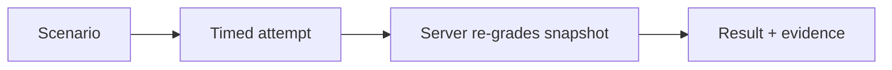
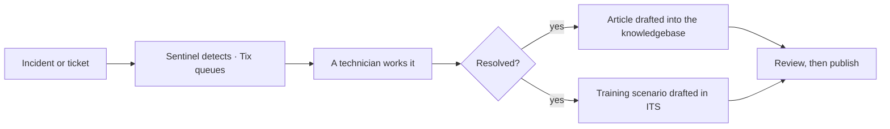

# OnTrak — TrainingOps Roadmap

> The **TrainingOps** platform of the
> [Innotel Platform Stack](https://github.com/innotelinc/innotel-platform-stack)
> — an [Innotel Labs](INNOTEL-LABS.md) product.
>
> Status legend: `[x]` shipped · `[~]` in progress · `[ ]` planned · `[-]` out of scope for v1
>
> This is the single source of truth for **what** the training platform does and
> **what comes next**. v1 is feature-complete; this roadmap finishes v1 and lays
> out the path beyond it.
>
> **OnTrak family release 2026.09** ([portfolio](../INNOTEL-LABS.md)): this
> product's slice of it is **v1.2 — real drivers**, shipped; the others are
> **OnTrak Tix M6** and **OnTrak Sentinel S3**.

---

## 1. Vision

Teach hands-on IT support the way it is actually done — in a realistic, timed,
automatically graded environment that runs in a browser, with no virtual machines
to provision. Then make the resulting **training evidence** usable: who was
trained, on what, when, and how well.

## 2. v1 status (shipped)

| Capability | Status |
| --- | --- |
| Linux (bash), Windows (PowerShell), Office (sheet/doc/mail) simulators | `[x]` |
| Clickable Windows 11 desktop surface driving the same machine state | `[x]` |
| Deterministic server-side grading, re-grade, hint penalties | `[x]` |
| Derived availability + licence gate (OPEN / EVALUATION / LICENSED) | `[x]` |
| RBAC (admin / instructor / student) on middleware **and** every action | `[x]` |
| Scenario authoring + validator ("passes before work" warnings) + templates | `[x]` |
| Cohorts, join codes, assignments, due dates, attempt caps, time limits | `[x]` |
| Admin control room: platform toggles, software inventory, keys, users, audit | `[x]` |
| Student experience: timed attempts, autosave, results, personal bests | `[x]` |
| PWA / mobile quick-keys / offline shell | `[x]` |
| Test suite (208) + typecheck + production build green | `[x]` |
| Pure, unit-tested form/rule modules; ownership-guarded actions | `[x]` |
| Versioned migrations (`prisma/migrations`) applied identically by every environment | `[x]` |

**v1 is complete as a training product.** The remaining work is depth, reach, and
enterprise readiness.

## 3. Architecture recap

- **Pure simulator** (`src/lib/sim/`) — no framework imports; runs in the
  browser, on the server, and in tests.
- **Driver seam** — every console implements `ShellDriver`; today the drivers are
  in-browser simulations, and a container-backed driver can slot in behind the
  same interface without touching the UI, scenario format or grader.
- **Server-side grading** — `coerceSubmittedState` → `gradeAttempt`; client
  scores are never trusted.
- **Stack** — Next.js + React + TypeScript + Prisma + PostgreSQL; pure
  `*-rules.ts` modules for all form/unit/date logic.
- **One family identity, six roles.** This app's three roles are a slice of one
  vocabulary shared with OnTrak Tix, OnTrak Sentinel, OnTrak Sync and
  [OnTrak Portal](ontrak-portal/README.md): `ADMIN`, `SYSADMIN`, `ANALYST`,
  `TECHNICIAN`, `INSTRUCTOR`, `STUDENT`. The deployed Network uses Cerulean
  (Authentik) as the directory, and OnTrak Sync owns the family's local account
  table — which is what the portal's password sign-in delegates to rather than
  inventing a second login. See
  [docs/family-operations.md](docs/family-operations.md).
- **One family theme, [Unity](theme/README.md).** Every surface in the family —
  this app, Portal, Tix, Sentinel and Sync — loads the same token set rather than
  a private palette, with `desk` (violet) and `operations` (graphite) schemes and
  a light/dark switch on top of each. Unity is also the standard for the rest of
  the Innotel platforms, so a change to it is a change everywhere.
- **A platform in the Innotel stack.** OnTrak is the **TrainingOps** platform of
  the [Innotel Platform Stack](https://github.com/innotelinc/innotel-platform-stack)
  (registered there as the `ontrak` component), beside AthenIQ (LearningOps) and
  Signara (DocumentOps), and it consumes the same shared layers they do:
  Authentik, Cerulean Vault, Cerulean, ONYX and NPM Edge.

## 4. Milestones

### v1.0 — Complete (shipped) `[x]`
The feature set in §2. Exit already met: a class can sign in, run graded
scenarios on three platforms, and instructors can author, assign and re-grade.

### v1.1 — Content, insight & polish `[~]`
**Goal:** more practice, better feedback, a smoother surface.

- `[x]` An analytics dashboard for instructors: per-check pass rates,
  time-on-task, trends and per-scenario rollups (`/instructor/analytics`).
- `[x]` More bundled scenarios and a richer template gallery: Linux
  networking, Linux accounts lifecycle, Windows endpoint/accounts and a
  service-desk mailbox triage starter, each validated and added to the demo
  seed. The `file_not_contains` check kind makes "the stale entry is gone"
  gradeable.
- `[x]` Accessibility pass (keyboard-first console, screen-reader labels). The
  workspace tab strip is a real `tablist` with roving arrow/Home/End keys and
  `aria-selected`; the file editor is a focus-trapped `role="dialog"` that
  closes on Escape and restores focus; the countdown is a `role="timer"` that
  announces in its final minute; the console region, progress bars and window
  controls carry accessible names; decorative icons are `aria-hidden`; the
  active nav item is marked `aria-current="page"`. An automated axe-core WCAG
  A/AA audit now runs in `npm test` (`tests/a11y.test.ts`) against the
  server-rendered desktop and Office surfaces in both locales, plus explicit
  keyboard checks (every control named, no positive `tabindex`), with a
  planted-violation guard so the audit cannot silently become a no-op. The
  paint-dependent rules that need layout and paint (`color-contrast` above all)
  are now covered by a browser sweep — `tests/browser/a11y.spec.ts`, run with
  `npm run test:a11y` — which drives real Chromium and audits the public pages
  plus the signed-in student dashboard and attempt workspace, and it is strict:
  every WCAG A/AA violation fails, `color-contrast` included. It caught a
  scrollable region without keyboard access on the landing page, and drove the
  accent palette to be darkened to clear the 4.5:1 floor.
- `[x]` A visible case-notes pad in the attempt workspace. Notes are a graded
  artefact (`note_matches` reads `machine.notes`), but on a Linux scenario the
  only way to write one was the `note` command — easy to miss. The workspace now
  has a **Notes** tab with a labelled input, an add button and a removable list,
  rendered alongside the other panels on wide screens and writable on mobile. It
  writes to the same `machine.notes` the command and the grader use, so grading
  and autosave are unchanged.
- `[~]` Localization groundwork: translator + `en`/`es` dictionaries, a locale
  cookie and a shell language switch are in place. The staff and admin surfaces
  are now fully translated through a shared `getTranslator()` server helper
  (with a client `LocaleProvider`/`useTranslator()` for the scenario editor):
  the shell, sign-in and registration, the attempt console, the instructor
  overview, analytics, scenarios (list/new/detail and the editor), attempts
  (list/review), classes, the admin control room, audit log, software inventory
  and people, plus the student queue, results index and attempt report and the
  attempt console shell (header, checklist, machine, help, hints, editor). The
  deep simulator surfaces are now translated too: the Terminal chrome and
  quick-keys, the Office panels (spreadsheets, documents and the mailbox) and
  the Windows desktop (window chrome, all eight apps, taskbar and start menu).
  Remaining: the server-generated task/check text, which comes from the
  scenario definition rather than the UI.
- `[x]` Hardening pass on staff-owned data: attempt viewing, the instructor
  analytics dashboard and re-grading are scoped to the instructor's own
  students, authored scenarios and assignments (administrators still see
  everything); the validator rejects a `file_owner` check that compares nothing
  and a blank label; the admin actions verify a chosen class actually exists and
  refuse to delete an author whose scenarios — and every attempt against them —
  would cascade away; and re-grading refuses `IN_PROGRESS`/`ABANDONED` work
  instead of quietly marking it `GRADED`. Covered by new tests for the attempt
  scope, the admin guards and the validator's edge cases.
- `[~]` Verifiable completion records reach the product surface: clearing the
  pass mark issues a **certificate** — a tamper-evident completion record — shown
  on the attempt report with its code and competency tags, listed on the results
  index, printable as its own sheet, and checkable by anyone at the public
  `/verify` page (record or assurance packet). The record is now **stored on the
  attempt** when it is issued, so the code a learner holds keeps verifying after a
  re-grade instead of being silently re-pointed at a different record; a re-grade
  that drops the attempt below the pass mark revokes it, visibly. A class's
  certificates export together as a signed packet (v1.5).
- `[x]` Versioned migrations: `prisma/migrations` is the schema history, applied
  by `prisma migrate deploy` in every environment (see CONTRIBUTING.md), so a
  deploy no longer depends on a `db push` having been run by hand at some point.
- **Exit:** a cohort dashboard renders trends (`[x]`); strings are externalised
  and a non-English locale ships (`[~]`, in progress); the a11y implementation,
  the automated axe/keyboard audit (`npm test`) and the browser paint-rule sweep
  (`npm run test:a11y`) have all landed and pass (`[x]`).

### v1.2 — Real drivers `[x]`
**Goal:** higher-fidelity practice behind the existing seam.

- `[x]` **A sandbox-backed `ShellDriver` for genuine bash.** `src/lib/sim/drivers/container.ts`
  runs each command line in a disposable container (`docker create` with no network, no
  capabilities, `no-new-privileges`, and memory/CPU/PID ceilings — see `dockerCreateArgs`)
  and, after every command, **harvests the sandbox filesystem back into `EngineState.vfs`**:
  type, permissions, owner, group, mtime, size and content for every entry, NUL-delimited so
  a filename with a space, a quote or a newline survives. Because grading reads only
  `EngineState`, `file_exists`, `file_contains`, `file_mode`, `dir_exists` and `file_absent`
  grade a real filesystem, and command history is recorded in the same shape, so
  `command_matched` and `command_sequence` are unchanged. `cd`, `pwd`, `cd ~` and `cd -` are
  the driver's own (every command is a fresh process), a failed `cd` changes nothing, and a
  harvest that fails leaves the previous tree in place rather than grading a half-read one.
  The same port also has a **process** backend (real bash in a scratch directory) which is
  what makes the automated test exercise genuine bash with no Docker daemon; it is refused
  unless both `ONTRAK_SANDBOX_BACKEND=process` and `ONTRAK_SANDBOX_ALLOW_PROCESS=1` are set,
  because it runs commands on the app server with no isolation.
- `[x]` **Graceful fallback, so the product never becomes unavailable.** Fidelity is resolved
  on the server when the attempt page renders (`resolveFidelity`), and a scenario that asks
  for a sandbox on a deployment without one runs in the simulated engine with the reason shown
  on screen. If the sandbox stops answering *mid-attempt*, the browser-side proxy
  (`src/lib/sim/drivers/proxy.ts`) falls back once, tells the student, and the rest of the
  attempt is simulated — every check still grades.
- `[x]` **Scenario metadata: `simulated | container`.** Declared in the definition
  (`fidelity`), validated (container fidelity is an error for PowerShell and Office, since a
  `pwsh` process on Linux under a scenario that promises Windows would be fidelity theatre),
  surfaced as a badge on the attempt console and as a warning in the editor, and honoured by
  the availability rule: a sandbox-only scenario is not offered where there is no sandbox
  (`kind: "sandbox"` blocker). Attempts in a sandbox go through a server action per command
  (`sandboxCommand`) against one sandbox per attempt, disposed of on submit, abandon and
  restart, and reaped after 30 minutes idle.
- **Exit:** `[x]` a scenario authored for real bash runs in a sandbox and grades identically
  to the simulated driver on the bundled checks — `tests/sim-container.test.ts` grades the same
  five-check scenario twice, once simulated and once under real bash in a process sandbox, and
  asserts the two reports agree check for check at 100% (26 checks in the suite, including the
  harvest round trip, the container flags and argv, the fallback paths and the session registry).
  The container backend itself was verified against a real Docker daemon: create → start →
  seed → `chmod` → harvest → grade, with the mode change read back and no container left
  behind.

### v1.3 — Identity & integrations `[~]`
**Goal:** fit into an organisation.

- SSO via the **OnTrak Sentinel** IdP (OIDC/SAML), with SCIM roster sync; keep a
  local JWT fallback for standalone deployments.
  - `[x]` **The training app signs in through a provider.** It is a relying party:
    the pure rules (`src/lib/oidc-rules.ts`), the client that does discovery and
    the code exchange with `jose` verifying the ID token against the JWKS
    (`src/lib/oidc-client.ts`), the signed authorization-state cookie, and
    `/api/sso/start` + `/api/sso/callback`. Claim mapping decides the local role
    (`ONTRAK_OIDC_ROLE_MAPPINGS`), a first sign-in provisions an account with **no
    local password**, and `User.externalId` holds the provider's subject so a
    rename at the directory is a *move* rather than a second account. There is no
    tenant slug — one deployment, one provider — and nothing changes for a
    deployment that names none: the sign-in page only offers the button when a
    handshake can actually complete. Covered by `tests/oidc.test.ts` (32 checks),
    including a full handshake against a real OpenID provider on a loopback port
    and the forgeries it must refuse — and by the opt-in `tests/sso-live.test.ts`,
    which starts the app itself and walks `/api/sso/start` → the provider →
    `/api/sso/callback` with a cookie jar, then fetches a protected page with the
    session it issued, so the claim being proved is about the routes and not only
    about the rules.
  - SCIM 2.0 provisioning at the provider is **shipped** (Sentinel's S2): Users and
    Groups, a connector token minted in the console, and deprovisioning that ends
    sessions and revokes their tokens. On this side there is no directory *sync*
    from AD/Entra/Google yet — that is the rest of S2.
  - MFA is enforced at the provider, so an organization that requires a second
    factor gets it here without the training app implementing one; a session is
    refused until a confirmed factor has been verified.
  - `[x]` **The family has a front door, and this app is not it.**
    [OnTrak Portal](ontrak-portal/README.md) is a relying party to the same
    provider and the same group claims, so the role deciding which tiles it draws
    is the role this app already checks. It authorises nothing — this app keeps
    re-checking the caller itself — and it holds no accounts: its password form
    delegates to [OnTrak Sync](ontrak-sync/README.md), which owns the family's
    local account table. Deployed on Cerulean's Authentik, with the five
    hostnames, the role groups and the redirect URIs written down in
    [docs/family-operations.md](docs/family-operations.md).
- LTI 1.3 so scenarios can be launched and graded from an LMS.
- Public API + webhooks for attempt/grading events, and bulk CSV import/export of
  rosters and results.
- **Exit:** an org signs in through its IdP, rosters sync over SCIM, and results
  flow to an LMS and a webhook consumer.
  - Signing in through an IdP is done; the roster half of the exit criterion is the
    directory sync above, and the LMS/webhook half is the bullets below.

### v1.4 — Authoring at scale `[ ]`
**Goal:** a catalog a team can maintain.

- Scenario versioning with draft/preview/rollback and change history.
- Collaborative authoring (comments, review/approval before publish).
- Import/export bundles and an optional shared scenario marketplace.
- **Exit:** two authors co-edit a scenario through review to publish, with full
  history and one-click rollback.

### v1.5 — Assessment, credentials & training evidence `[ ]`
**Goal:** turn results into credible, portable proof of competence.

- `[ ]` Rubrics beyond pass/fail; partial-credit and competency tagging per check.
- `[~]` Certificates and a skills matrix (who is competent in what), with
  verifiable completion records. A pass issues a certificate and the record is
  **stored immutably** on the attempt (`certificate`/`certificateIssuedAt`/
  `certificateRevokedAt`), presented on the report with its code and
  competencies, printable as its own sheet (`/certificate/<attempt>`), and
  verifiable without an account (see v1.1). Still to come: the skills matrix.
- `[x]` **Auditable training evidence**: immutable completion records and an
  exportable proof-of-training packet per class — every live certificate its
  members hold, bundled into one signed document at
  `/instructor/cohorts/<id>/packet`, scoped to the instructor who runs the class
  and recorded in the audit log. The training-side counterpart to OnTrak Tix's
  assurance packets, for compliance and insurance.
- Optional proctoring/timing integrity controls for higher-stakes assessment.
- **Exit:** a learner earns a verifiable certificate; an auditor can pull a
  signed proof-of-training packet for a cohort.

### v1.6 — The learning loop `[~]`
**Goal:** make practice flow in both directions, so the desk and the classroom
feed each other instead of being two products that happen to share a login.

An incident, a ticket, or a manual entry is the material; a resolution is the
lesson. Nothing in the loop is a separate thing a person has to go and create.

- `[~]` One front door and one identity for the whole family — Portal is the way
  in, and every product accepts the same session. Sign-in is Cerulean SSO;
  local passwords are a break-glass path, not a parallel login, and the
  remaining local sign-in surfaces are being retired product by product.
- `[ ]` Resolution → knowledgebase article. When a ticket or incident closes, the
  AI draft is generated from the ticket's own trail (what was asked, what was
  tried, what actually fixed it) and lands as a **draft** for a human to approve.
- `[ ]` Resolution → training scenario. The same trail becomes a scenario
  definition — the checks are the steps that actually resolved it — with the
  authoring validator run so a generated scenario cannot be one that "passes
  before any work is done".
- `[ ]` Every source, one pipeline: incidents forwarded from Sentinel, tickets
  entered by hand, and automated sources all enter through the same path, so
  there is one place to look when a draft does not appear.
- `[ ]` Provenance on both artefacts: which ticket produced this article or
  scenario, and who approved it. A generated lesson with no origin is a lesson
  nobody can check.
- **Exit:** a resolved incident produces a reviewable article and a runnable,
  validated scenario without anyone opening an authoring tool — and both link
  back to the ticket that caused them.

### v2.0 — Enterprise training platform `[ ]`
**Goal:** multi-organisation, evidence-grade, assistive.

- Multi-tenant organisations with isolated catalogs, branding and reporting.
- BI/warehouse export and scheduled reporting.
- Opt-in AI tutor: hints, misconception detection, and scenario suggestions —
  always assistive, never auto-grading.
- Hardening: deeper audit trail, retention controls, SSO/SCIM at org scale.
- **Exit:** two organisations run isolated catalogs and reports under one
  deployment with audited, retained training records.

## 5. Cross-cutting requirements

- **Accessibility** — WCAG AA target; keyboard-only console fully usable.
- **Performance** — attempt page interactive < 1.5 s p95; grading < 200 ms.
- **Security** — never trust the client; re-grade server-side; audit every
  privileged action (already the standard).
- **Testing** — every bug fix ships a regression test; pure logic stays in
  `*-rules.ts` and `src/lib/sim/`.

## 6. Success metrics

| Metric | Why |
| --- | --- |
| Scenarios completed per learner | Engagement |
| Pass rate & median score by scenario | Difficulty calibration |
| Time-to-first-scenario for a new cohort | Onboarding friction |
| Instructor authoring time per scenario | Content velocity |
| % learners with a verifiable certificate | Outcome |
| Proof-of-training packets exported | Compliance/insurance value |
| Container-driver parity on shared checks | Fidelity trust |

## 7. Risks & open questions

- **Container drivers** cost and complexity — sandboxing, cost caps and fallback
  behaviour need explicit limits.
- **LMS/LTI scope** — decide how much to build versus integrate.
- **AI tutor** — keep it assistive and opt-in; never let it auto-grade.
- **Localization** — sequencing (v1.1 groundwork vs later full locales).
- **Evidence vs privacy** — training records are personal data; retention and
  consent must be designed, not bolted on.

## 8. Immediate next steps

1. Prototype the container-backed bash driver behind the existing `ShellDriver`
   seam with a resource cap and fallback (v1.2).
2. Persist completion records against the attempt and export a proof-of-training
   packet per cohort, so the certificate work already shipped becomes auditable
   (v1.5).
3. Close out v1.1: the only open item is the scenario-authored task/check text,
   which lives in the definition rather than the UI.
4. Decide the LMS/LTI scope — build versus integrate — before starting v1.3.
