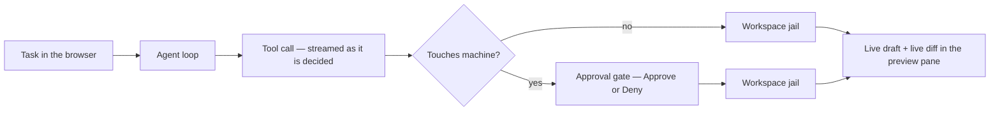

# OnTrak Genie roadmap

**Classification: CodeOps** — the browser console for a coding agent: an agent's
work made visible and gated, in one workspace, on the operator's own machine.
See [stack.md](stack.md) for the role and [operations.md](operations.md) for the
full developer reference.

> Status legend: `[x]` shipped · `[~]` in progress · `[ ]` planned · `[-]` out of
> scope for v1
>
> This is the single source of truth for **what** Genie does and **what comes
> next**. It is written so the next person reads the code rather than rebuilding
> it: every shipped line points at the file that carries it, and every open line
> states what is missing rather than implying it is done.

> **Status.** **0.1 shipped** — the console is complete: the agent loop streamed
> over SSE, the workspace jail, the tool set, the approval gate, live draft and
> live diff, per-file snapshots, the model-resilience chain, and a browser UI
> with no build step. **0.2 shipped** — stack citizenship: sign-in is **on** at
> both edge names, secrets are read from **Cerulean Vault** through path-scoped
> `vault://` references, tenancy is **on** through Distro's control plane, and the
> image is published with a pull-only overlay beside the product compose. **0.3
> is complete** — resilience and reach: the console is honest about what the
> gateway actually streams, the approval gate has a channel besides the browser,
> the workspace has a real toolchain, the app itself is shown rather than only the
> code that builds it, and a chat can now be named, put away and deleted beside a
> workspace chosen per account. **1.0 is in progress** — the CodeOps surface:
> isolated workspaces per account with a ceiling Genie enforces itself, an audit
> trail an operator can read, and a deployment posture that is written down rather
> than assumed ([threat-model.md](threat-model.md), [runbook.md](runbook.md)).

## 1. Vision

Your wish is my command. The usual coding-agent interface shows a spinner, then
a finished diff you have to audit afterwards; Genie shows the tool calls as they
are decided, the file being written while it is still being written, and a diff
against disk *before* the write lands — with a human gate between a plan and a
changed machine.

## 2. v0.1 status (shipped)

| Capability | Status |
| --- | --- |
| Agent loop — request → tool call → result, streamed over SSE | `[x]` |
| Workspace jail — escapes and absolute paths refused, trees skipped | `[x]` |
| Tool set — `read`, `edit`, `write`, `list`, `search`, `run` | `[x]` |
| Approval gate — `off` / `risky` / `all`, deny ends the turn, times out closed | `[x]` |
| Live draft — the write rendered character by character while it arrives | `[x]` |
| Live diff — the change against the on-disk baseline, before the write lands | `[x]` |
| Per-file snapshots — a viewer diff against what replaced the file | `[x]` |
| Model resilience — fallback chain, retry re-walk, chain-health timer | `[x]` |
| Free-plan model service — a plan with no subscription is served the healthiest free model, and offered no picker | `[x]` |
| Catalog sweep — probe which advertised ids can actually call a tool, from the UI | `[x]` |
| Offline gateway — a second, independent gateway tried only after the chain | `[x]` |
| Text-mode tool calls — salvage a weak model's JSON-prose call | `[x]` |
| Command sandbox — `docker run --network none --read-only`, workspace only | `[x]` |
| Persistence — sessions, transcripts, snapshots, `sweep.json`, `workspace.json` | `[x]` |
| Sign-in — Authentik OIDC, code + PKCE, RS256 id_token vs JWKS, signed cookie | `[x]` (on at both names) |
| Tenancy — Distro control plane: identity, quota, usage, audit | `[x]` (wired, off) |
| Per-account disk scope — `accounts/<account>/` for workspace, chats, history | `[x]` |
| UI — transcript, tool cards, preview pane, diff view, sweep panel, a11y | `[x]` |
| Unity theme + landing page published under the family site | `[x]` |
| Checks — `node --test`, `ui-smoke`, `draft-check`, `offline-check`, `model-health` | `[x]` |
| No runtime dependencies in `public/` — the console is served, not built | `[x]` |

**v0.1 is complete as an agent console.** What is outstanding is not the console
— it is that the console does not yet stand in the stack the way its siblings do.

## 3. Architecture recap

- **One HTTP server** (`src/server.ts`) — UI + JSON API + SSE, no framework and
  no bundler; `public/` is served as written.
- **The turn loop** (`src/agent.ts`) — chain selection, retry re-walk, tool
  dispatch and event emission; the approval gate (`src/approval.ts`) parks the
  stream on a second connection rather than blocking it.
- **The jail** (`src/workspace.ts`) and the account scope (`src/scope.ts`) are
  the two answers to "where may this touch": the former bounds the sandbox, the
  latter keys it to an account. Every store, the path jail, the ripgrep root and
  the `run_command` mount resolve through them.
- **The model layer** never holds a provider credential — Genie speaks only the
  OpenAI-compatible wire format, and the gateway's address arrives from the
  environment.
- **Stack placement.** Genie is the **CodeOps** member of the OnTrak family and a
  component of the Innotel Platform Stack. It consumes OmniRoute, Distro's control
  plane, Authentik, Cerulean Vault or Cerulean DNS/TLS and NPM Edge. It owns none
  of them.

## 4. Milestones

### v0.1 — The console `[x]`

The feature set in §2. Exit met: a task can be stated, watched while it is worked,
approved or denied at the gate, and the session resumed after a restart.

### v0.2 — Stack citizenship `[~]`

**Goal:** make Genie a first-class member of the stack rather than a console that
happens to be in the repo.

- `[x]` **Sign-in on by default at the edge.** Authentik OIDC is configured on
  the family deployment (`ONTRAK_OIDC_ISSUER` =
  `https://auth.cerulean.innotel.us/application/o/ontrak`, the `ontrak` client id,
  the client secret and a generated `ONTRAK_OIDC_SESSION_SECRET`), the `OnTrak`
  provider carries a redirect URI per deployment name, and reaching the console
  requires a sign-in. **Both names sign in on their own URI**: the redirect
  resolution reads the browser's `Host` and picks the matching entry, so
  `genie.ontrak.innotel.us` and `genie.innotel.us` each complete a code flow
  rather than one name bouncing its session onto the other.
- `[x]` **Tenancy through Distro's control plane.** `src/controlplane.ts` and
  `src/tenancy.ts` speak the same `/api/internal/identity`, `/quota-check`,
  `/usage-report` and `/audit` contract Studio uses, with the deliberate key
  posture (strict identity, fail-open quota, best-effort ledger). On the family
  deployment `CONTROL_PLANE_INTERNAL_URL` points at Distro's plane and the service
  token arrives as the `vault://cerulean/ontrak#CONTROL_INTERNAL_TOKEN` reference,
  so a turn resolves to the signed-in subject's own account and spends that
  account's gateway key instead of the shared one — which is what makes
  per-account quota and usage real. Sign-in is what gives the subject to key on.
- `[x]` **Secrets from Cerulean Vault.** `.env` now holds `vault://` references
  rather than values, resolved at container startup by `scripts/vault-env.mjs`
  (run from `docker-entrypoint.sh`) under the path-scoped KV v2 `ontrak` token the
  rest of the estate uses — covering only `cerulean/data/ontrak`. The resolver is
  fail-fast: a reference that cannot be resolved, a missing key or an unreachable
  store stops the container instead of booting with a literal `vault://` string,
  which is what makes a partially-migrated deployment impossible rather than
  merely unlikely (§8). Cerulean mints the token (it is in `VAULT_PRODUCT_TOKENS`)
  and the family stack mounts it read-only; moving the first values in is one
  `scripts/vault-migrate.py` run.
- `[x]` **The operator surface at the edge.** Cerulean owns DNS/TLS and NPM Edge
  owns the public route; Genie registers the names through Cerulean rather than
  writing DNS or the NPM API itself (the platform rule the standard states).
  **Both names are live and gated** — `genie.ontrak.innotel.us` (family) and
  `genie.innotel.us` (platform) are registered in the `innotel.us` zone and on
  the edge, each forwarding to the Genie app on `192.168.1.21:3400` under the
  estate's wildcard certificate (NPM hosts 195 and 197, certificates
  `*.ontrak.innotel.us` and `*.innotel.us`), and both sit behind the same
  Authentik sign-in as the rest of the estate.
- `[x]` **A published image and a stack entry.** Genie is `0.2.0` and publishes to
  `ghcr.io/innotelinc/ontrak-genie` as its `runtime` stage — one image and no
  `-migrate` twin, because it has no database — from the same `publish.yml` /
  `scripts/publish-images.sh` list the other products use. Beside the product
  compose sits `docker-compose.prod.yml`, the pull-only overlay
  (`make genie-prod-up`, `ONTRAK_GENIE_IMAGE_TAG`), and the family stack's
  `genie-app` entry names the same version, so a deploy is a pull rather than a
  build.
- `[x]` **Model-chain health on the deployment.** The chain is pinned in the
  deployment's environment rather than left on `auto/*`:
  `AGENT_MODEL=openrouter/free` with
  `AGENT_FALLBACK_MODELS=openrouter/cohere/north-mini-code:free,gemini/gemini-3.1-flash-lite`,
  every entry an explicit id checked for a real tool call. The chain leads with
  OpenRouter's free router because a free Gemini tier exhausts its daily quota
  and a Gemini-only chain then dies on the first turn; the Gemini model stays
  last so a deployment whose quota has reset still reaches it. The chain-health
  row and `model-health` remain the guards.

**Exit:** reaching `genie.innotel.us` requires an Authentik sign-in, a signed-in
turn spends that account's own gateway key and is refused when it may not spend,
secrets are read from Vault, and the name is a Cerulean-registered route — not a
hand-written DNS record and an NPM host someone clicked.

### v0.3 — Resilience and reach `[x]`

**Goal:** the console stays useful when the gateway, the plane or the model does
not.

- `[x]` **Streaming fidelity where the gateway supports it.** The stream already
  sees how a call arrives, so a `draft` event now carries `streamed`: false when
  the pane was only ever shown the finished body — what the LAN gateway's Gemini
  path produces by handing the whole call over in one frame. The pane says
  *written in one frame* rather than implying a stream that never happened, and
  `draft:check` reports the same field (its `--require-fragmented` failure now
  comes from the server's own answer, not a frame count). Both shapes are pinned
  by `src/test/draft-streaming.test.ts`, and the pure rule by
  `draftStreamed` in `src/test/draft.test.ts`.
- `[x]` **A second approval channel.** `GET /api/approvals` lists what the cards
  would show and `POST /api/approvals/:id` still answers, so the gate is reachable
  without watching a tab; `npm run approvals` (`scripts/approvals.mjs`) is the
  headless driver a CI job uses. Every decision — from either channel, including a
  timeout or a cancelled stream — is appended to `<AGENT_DATA_DIR>/approvals.jsonl`
  with the actor, so unattended running still leaves a record of who let what run.
- `[x]` **Session and workspace management.** Listing was the whole of this while
  a deployment was one operator with one pile of chats; the missing half was the
  ordinary housekeeping, and all of it is on the row itself rather than behind an
  admin screen, because the person who owns a chat is the person who knows which
  of them it needs. **Naming** flattens and bounds the title (`normalizeTitle`),
  because it is drawn into a one-line list; **archiving** is a flag on the chat
  and nothing else — the transcript, its file history and its directory are
  untouched, which is what makes it reversible by the owner rather than by an
  administrator, and the list folds archived chats behind a count rather than
  hiding that they exist; **deleting** is armed in two clicks for the same reason
  deleting a file is, and deleting the chat you are looking at leaves you in a
  fresh one instead of in a transcript whose record is gone. The **workspace
  choice is per account**, keyed exactly as the scope is — it was deployment-wide
  on the reasoning that the window picking it *was* the operator's, which tenancy
  turns into a bug: one person choosing `project-a` would have moved everybody's
  tools, including an account that had chosen `project-b`. The **sweep report**
  followed for the same reason: the catalog is shared but the report is what
  *this* account last measured, so it is written beside the account
  (`accounts/<account>/sweep.json`) and loaded lazily per key. An install that
  never signs in reads the one choice it wrote, in the one slot it wrote it to.
  Pinned by `src/test/session-management.test.ts` and the per-account cases in
  `src/test/scope.test.ts`.
- `[x]` **Per-account usage visible in the console.** The ledger is written and
  the account can now read it back: `GET /api/account/usage` resolves the caller
  exactly as a turn does and returns the plane's own answer — today's requests,
  tokens and cost, the caps it is judged by, and its allow/deny verdict — and the
  sidebar renders it (`usage: today n req / t tok / cap`). Because the number
  shown and the number that refuses the next turn come from the *same* decision,
  they cannot disagree; a deployment with no control plane has no account to read
  and says so rather than showing a fake zero. Pinned by
  `src/test/account-usage.test.ts`.
- `[x]` **A toolchain in the workspace, and the network to use it.** The runtime
  image carries bash, git, ripgrep, curl, wget, jq, make, gcc/g++, python3 + pip
  and unzip, and the system prompt tells the agent to install what else it needs
  (`apk add`, `pip install`, `npm install`) rather than work around it — "curl not
  found" is not an answer this agent gives. `AGENT_SANDBOX_NETWORK` (default
  `none`) is the deliberate opt-in for the sandboxed case, and the compose
  deployment runs on the host path where the container is already the boundary.
- `[x]` **The app, running.** `preview` used to open on the code the agent was
  writing; it now opens on the project *running*, and reloads it as files change.
  `src/preview.ts` owns one dev server per workspace, the port it ended up on, and
  the change feed; the app is proxied same-origin and gated like any other read,
  both under `/preview/` (with root-relative URLs rewritten, so a page asking for
  `/assets/app.js` keeps its links inside the pane) and at the console's own root,
  because a bundler's URLs — `/@vite/client`, `/_next/webpack-hmr`, a dynamic
  import — are strings no rewrite can reach. Websocket upgrades are forwarded too,
  which is what a development server's hot reload actually is. Which command to
  run is detected from the project rather than configured, and named  as detected
  in the pane; `show code` still shows the file being written.
- `[x]` **An address the rest of the network can use.** The pane's `/preview/` is
  a path on the console: right for the person looking at it, useless to a webhook,
  a phone, or a gateway calling back into the app. `AGENT_LAN_IP`,
  `AGENT_PREVIEW_HOST` and `AGENT_PREVIEW_PUBLISH` publish the app at the
  deployment's LAN address and report it as `address`, so "where does the app
  live" has one answer that is never `172.17.0.1` — the platform's own rule for
  an upstream, applied to a preview. `AGENT_SANDBOX_NETWORK=host` is the same
  answer for a sandboxed command that starts the app itself.

### v0.4 — Beyond a single operator `[ ]`

**Goal:** more than one person, more than one workspace, without the operator
becoming the bottleneck.

- `[ ]` **Shared sessions.** Hand a transcript to a colleague with the same
  visibility, still gated per turn.
- `[ ]` **Repository-aware workspaces.** Gitea/Atlas as the source of a workspace
  — clone, branch and open a PR from the console — with the same jail and gate.
- `[ ]` **Diff review before write, not only during.** The live diff already
  exists; a queued "propose then commit" mode lets a reviewer approve a change set
  rather than one write at a time.
- `[ ]` **ONYX** is explicitly *not* this: Genie owns no storage; a shared artifact
  that outlives a workspace is ONYX's to hold.

### v1.0 — The CodeOps surface `[x]`

**Goal:** the counterpart, in a browser, of a terminal agent session — with the
gate the terminal does not have.

- `[x]` **Multi-tenant by account, with isolated workspaces and an audit trail.**
  The tenancy half was already there — an account's disk, chats and file history
  are its own, and Distro bills each turn to that account's own gateway key. What
  1.0 added is the record an operator can read afterwards, and where to read it:
  `approvals.jsonl` (every decision, including a timeout, with its actor), the
  account's transcripts and file snapshots, and Distro's ledger by account — the
  three are listed as one backup set and one incident order in
  [runbook.md](runbook.md) §9–§10, because an audit trail nobody can find is not
  one.
- `[x]` **A ceiling per account, not a price list.** The family runs on unlimited
  usage, so a quota here is not a bill: it is attribution plus a bound on a
  runaway loop, and the plan cannot supply the second because it never refuses
  anyone. `AGENT_ACCOUNT_CEILING_REQUESTS` is the number **Genie** enforces, and
  three decisions make it a stop rather than a licence: it is counted in
  `beginTurn` — the gate that spends, after the plane has allowed the turn — so
  nothing reaches the model around it; the day is UTC and the reset is a
  comparison rather than a timer; and the count is held **in the process** on
  purpose, so a restart forgives it, because a durable counter is a billing
  mechanism wearing a safety belt. `0` disables it. The account reads the number,
  the turns used against it and its `allowed` verdict at `GET /api/account/usage`
  (`docs/roadmap.md` → `src/ceiling.ts`, `src/test/ceiling.test.ts`).
- `[x]` Deployment posture: retained audit, an operator runbook, and a
  documented threat model for exposing a shell-capable agent at a name. The
  posture is now two documents rather than a paragraph:
  [threat-model.md](threat-model.md) names the four trust boundaries, the five
  adversaries and — the part that matters — the **residual** exposure behind each
  control, with the largest one stated plainly (the code the agent reads is sent
  to whichever provider answers, which is a property of using a hosted model at
  all, and the reason the offline gateway exists);
  [runbook.md](runbook.md) is what an operator does with it — deploy (and read
  the fail-fast Vault resolver as a feature), add a name (which needs an Authentik
  redirect URI, not only DNS), tell four refusals apart, read the two
  outage alerts as opposite things, act on a runaway loop, off-board an account
  without destroying its work, and the incident order to follow when an agent at a
  public name runs unattended. Retention is stated where it is practised:
  `approvals.jsonl` is append-only and pruned on a defended schedule, transcripts
  and snapshots are the backup set.
- **Exit — met (2026-10-01):** two accounts run isolated workspaces under one
  deployment with a gate on every destructive call and an auditable record of what
  each account did — with usage explained rather than charged. The last thing owed
  was a *deployment* fact rather than a code fact, so it is checked against the
  console people use rather than asserted: `npm run tenancy:check`
  (`scripts/verify-tenancy.mjs`) signs in as two of the control plane's accounts
  and requires two workspaces, two chat lists and two records, and against the
  family plane `dhunter@innotel.us` and `admin@cerulean.innotel.us` each got their
  own — with one real turn by the second moving **its** `usage_cache` row from 0 to
  1 request while the first's 64 were untouched. What is left open below is the
  *shared* half of running more than one operator (`v0.4`), not the isolation.

## 5. Safety and autonomy ladder

Genie's approval gate *is* its autonomy control: autonomy is earned per
deployment, not configured by a prompt, and the gate is the only thing between a
plan and a changed machine.

| Rung | Name | What it means | State |
| --- | --- | --- | --- |
| **L0** | Manual | `AGENT_APPROVAL=risky` (or `all`): every command and large write waits for a click | current |
| **L1** | Watched auto | A recorded run of a known task shape from which the operator raises the threshold — never by disabling the gate | later |
| **L2** | Policy-bounded | The gate stays, but a signed policy names what may run unattended inside the sandbox | later |
| **L3** | Unattended | `[-]` **Out of scope.** A coding agent that changes a host without a human decision is not a configuration this product ships | out |

The sandbox and the gate are independent on purpose: sandboxing stops a command
from reaching the host, approval stops it from running at all. Raising a rung
loosens the second, never the first.

## 6. Cross-cutting requirements

- **Safety first** — no privilege escalation, no `--network none` removal by
  default, no unreviewed write over the threshold; the refusal comes back to the
  model, never a crash.
- **No runtime dependencies** in `public/` — the console is served, not built, and
  the vendored highlighter keeps an invalid file watchable.
- **Testing** — every fix ships a regression test; `npm run check` runs the
  typecheck, the build, the unit suite and the browser smoke test in one command.
- **A11y** — landmarks, labelled controls, focus handling and a polite live
  region that announces tool results without narrating every streamed token.
- **Unity** — the family token set, not a private palette.
- **Attribution and license** — MIT, one author, no vendored provider SDK.

## 7. Success metrics

| Metric | Why |
| --- | --- |
| Turns that reach a tool call vs. turns that die on a model | Chain health actually matters |
| Approval decisions per turn, and deny rate | Whether the gate is used or clicked through |
| Time-to-first-tool-call after a task is stated | Responsiveness of the console |
| Sweep: usable ids ÷ ids claiming tool calling | The catalog is not a capability — 25 of 582 advertised ids answered on 2026-10-01 (see `docs/operations.md`) |
| Sessions resumed after a restart | Whether persistence is real |
| Accounts whose turns spend their own key | Whether tenancy is actually on |

## 8. Risks and open questions

- **Exposing a shell-capable agent at a public name** is the central risk. The
  posture is one gate (Authentik) plus the sandbox; the threat model in v1.0 is a
  deliverable, not a paragraph.
- **Provider capacity** — free tiers throttle, and a model that cannot call a tool
  fails the turn however strong it is; the chain mitigates, it does not remove it.
- **Local model quality** — a 7B model drives tools but rewrites more than asked;
  the offline gateway is a floor, not a peer.
- **Distro contract drift** — Genie and Studio share one control-plane contract;
  a change must land in both, and neither should grow a private variant.
- **Vault migration** — moving `.env` values to `vault://` needs the path-scoped
  token and a deploy-time resolver; a half-migrated deployment is worse than an
  un-migrated one. **Mitigated:** the resolver is fail-fast, so a reference whose
  secret, key or store is missing stops the container at startup rather than
  booting with a placeholder — a partial migration fails loudly, not silently.
  What remains is keeping the two halves in step: a value moved to Vault must
  arrive as a reference *in the same change*, or the plaintext stays authoritative.

## 9. Not in this roadmap

- **Identity (Authentik), secrets (Cerulean Vault), trust/DNS/TLS (Cerulean),
  storage (ONYX), revenue (Magnate) and model routing policy** — Genie integrates
  with these instead of re-implementing them; it chooses which model id to ask for
  and reports what came back, and the gateway decides which provider answers.
- **Auto-merge and unattended host changes** — see the ladder's L3.
- **A second builder/execution plane.** Atlas keeps the ecosystem's code and CI;
  Genie is a console over a workspace, not a factory.

## 10. Immediate next steps

1. ~~Register `genie.ontrak.innotel.us` and `genie.innotel.us` through Cerulean
   (DNS + NPM Edge) against a decided deployment target.~~ **Done** — both A
   records and both proxy hosts are live against the Genie app on
   `192.168.1.21:3400`. The same change still owes the Authentik application and
   its redirect URI, so the name is gated rather than merely routed (v0.2).
2. ~~Turn tenancy on~~ **Done** — `CONTROL_PLANE_INTERNAL_URL` points at
   Distro's plane on `192.168.1.61:20140` and `CONTROL_INTERNAL_TOKEN` arrives as
   a `vault://cerulean/ontrak#CONTROL_INTERNAL_TOKEN` reference, so a turn
   resolves to the signed-in subject's account and spends its own gateway key.
   The token moved to Vault in the same change, as item 3 requires. `WEB_TOKEN`
   stays as the API-client bearer until it does not.
3. ~~Move the deployment's secrets to Cerulean Vault `vault://` references with
   the path-scoped token (v0.2).~~ **Done** — `OMNIROUTE_API_KEY`,
   `ONTRAK_OIDC_CLIENT_SECRET` and `ONTRAK_OIDC_SESSION_SECRET` live at
   `cerulean/ontrak` and `.env` points at them; the image resolves them at boot
   under the `ontrak` policy. `WEB_TOKEN` and `CONTROL_INTERNAL_TOKEN` are unset
   on the deployment today and move the same way when they are set.
4. ~~Publish a versioned release image and add Genie's entry to the platform's
   group compose so a deploy is a pull (v0.2).~~ **Done** — Genie publishes as
   `ghcr.io/innotelinc/ontrak-genie:0.2.0` (the `runtime` stage, and no migration
   image because there is no database), the family stack's `genie-app` entry names
   that version, and `ontrak-genie/docker-compose.prod.yml` with
   `make genie-prod-up` is the pull-only deploy path the other products already
   had.
5. ~~Write the threat model and the operator runbook (v1.0).~~ **Done** —
   [threat-model.md](threat-model.md) (boundaries, adversaries, and the residual
   behind each control) and [runbook.md](runbook.md) (deploy, sign-in, the four
   refusals, the two outage alerts, a runaway loop, off-boarding, the incident
   order). The *deployment* half of 1.0's exit is now met too: two accounts are
   isolated on a running console, each with its own key, workspace and record,
   proven by `npm run tenancy:check` against the live control plane rather than
   described (see the exit above). `docs/operations.md` § *Two accounts, two
   workspaces* carries the check and the measurement.
